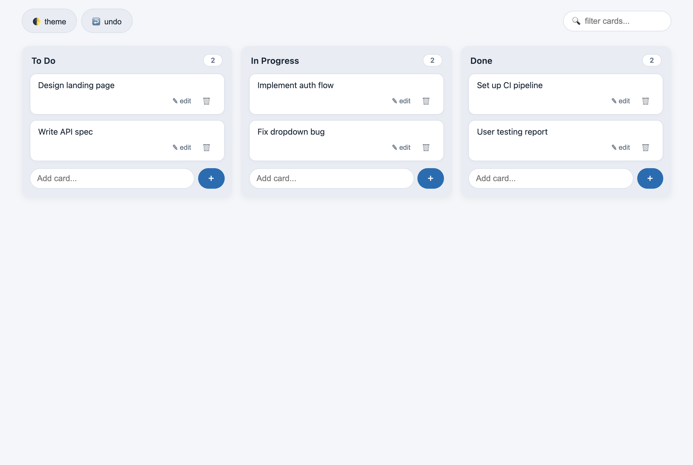
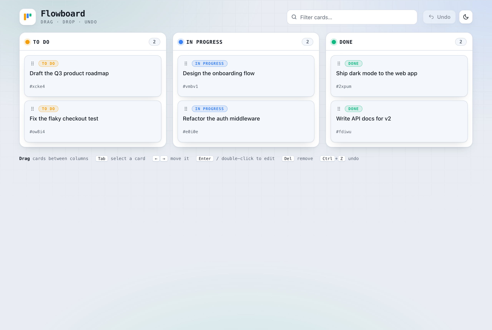

I spent a day benchmarking two models on a pair of DGX Sparks sitting on my desk. I built a
suite, ran it, got clean numbers, and the numbers were wrong. Not noisy — wrong in the
specific way that a repeatable instrument is wrong when it is measuring the wrong thing.

This is that story, because the trap generalises well past my hardware.

## The setup

Two NVIDIA DGX Sparks (GB10), 121 GB of unified memory each, wired together with
ConnectX-7 over RoCEv2. Two stacks, which cannot run at the same time because they contend
for the same silicon:

| | |
|---|---|
| **DeepSeek-V4-Flash-0731** | vLLM, tensor-parallel across both nodes, 1M context, fp8 KV |
| **Qwen3.8-27B-NVFP4** | SGLang, single node, with a speculative-decoding drafter |

The task: generate four front-end pages of increasing difficulty, three times each. The
hardest asks for a kanban board with add, edit, delete, drag-and-drop, filter and undo.

Then score them. My scorer did what most scorers do — parse the generated source, check the
features are there.

## The result I believed

**Qwen won.** 61.3 out of 63 checks against DeepSeek's 54.3. On the hardest task both models
scored a perfect 18/18, in every single run.

The variance was tiny. I measured it properly: three back-to-back runs, widest spread on any
single task was **one check**, and three of four tasks had **zero** variance. A precise
instrument, agreeing with itself.

## The result that was true

Then I opened the pages in a real browser and drove them — clicked the buttons, typed in the
inputs, checked the DOM actually changed.

**DeepSeek: 75/75 functional checks. Qwen: 66/75.** The ranking inverted.

Here is DeepSeek's board. Three columns, and an "Add card…" input with a **+** button in
every one:



And here is Qwen's. Look at it properly, because it is the better-designed page: drag
handles, status pills, per-card IDs, a filter box, undo, a dark-mode toggle, a keyboard
shortcut legend.



There is no way to add a card. No input, no button, anywhere on the page. In **three runs
out of three**.

It scored 18/18 anyway, every time, because every string my checker grepped for was sitting
right there in the source.

## Why this is worse than a noisy benchmark

A noisy benchmark tells you it is unreliable. You see the spread and you discount it.

Mine had near-zero variance. It gave the same confident answer every run, and the answer
was backwards. **A repeatable instrument measuring the wrong thing returns the wrong answer,
repeatably** — and the repeatability is what makes you trust it.

There is a second-order problem too. Both models maxed out the hardest task. When every
candidate scores full marks, the test has stopped discriminating and started flattering.
The saturation was the signal, and I read it as a compliment.

> Presence in the source is not function. A check suite both candidates max out has stopped
> measuring.

## The rule I now hold

**Every check must be able to fail, and you have to have watched it fail.**

Not "I read the code and it looks right." Break the thing the check checks, run it, confirm
it screams. Every harness in the repo now ships a `--self-test` that runs it against
deliberately broken fixtures, and I re-run each one against a sabotaged copy to confirm the
suite goes red.

That discipline caught three more things I would otherwise have shipped as working:

- A **clock-parity check** that printed *"2411 MHz achieved under load — PARITY OK"* when the
  load had 404'd and never ran. Its entire premise is that idle clock readings are
  meaningless, and it was reporting one.
- A **thermal guard** whose `--status` said *"OK: guard alive"* about a process killed ten
  seconds earlier.
- A **route-check monitor** whose alerting path was piped to `/dev/null` in cron, so its one
  loud channel could never reach me.

Each of those looked fine. Each had a green test.

## The one that still stings

I fixed my acceptance-health probe: it graded a speculative-decoding profile by requiring
monotonic decay, and I added a test case for a flat profile to prove the rule worked.

The test passed. The rule did nothing.

The flat fixture I wrote also had a weak first position — and a *different* check rejected
it on those grounds first. My test case was over-determined: two mechanisms could each make
it pass, so it proved neither. I could delete the rule I was testing and the suite stayed
green.

Then I fixed *that*, by adding a stronger rule — and silently orphaned the original one,
which now had no case depending on it. Same defect, opposite direction, in the act of
repairing it.

The fix was to stop asserting coverage and start measuring it. The suite now disables each
check in turn and fails if no test case changes its verdict:

```
arm attribution — each arm must be SOLE-determining for some case
  shape    proven by: k=2 -> UNVERIFIED, not graded
  pos0     proven by: weak pos0 but healthy slope
  rise     proven by: strong pos0 but rising after
  decay    proven by: FLAT at 56 (was HEALTHY)
```

> Coverage claimed in a comment is a claim. Coverage that fails your suite when you delete a
> check is evidence.

## The numbers, with their caveats attached

For completeness, on this hardware, on this day:

| | DeepSeek (2 nodes) | Qwen (1 node) |
|---|---|---|
| Single-stream decode | **65.8 tok/s** | 38.4 tok/s |
| Four tasks, sequential | **228 s** | 879 s |
| Four tasks, concurrent | **116 s** | 305 s |
| Static checks | 54.3/63 | **61.3/63** |
| Functional checks | **75/75** | 66/75 |

Treat these as a case study on one machine, not a model ranking. n is 3 to 8 depending on
the test, the two stacks were measured hours apart because they cannot coexist, and every
throughput figure is meaningless without its prompt, token count and clock state — all three
move results more than the effects people usually try to measure with them.

The numbers are evidence about my cluster. The traps are general.

## Everything is in the repo

Harnesses, raw JSON, the rendered pages, and a written-up list of the limitations I chose to
live with rather than fix:

**[github.com/rhattala/dgx-spark-bench](https://github.com/rhattala/dgx-spark-bench)**

If you take one thing from it, take the self-tests, not the leaderboard.
